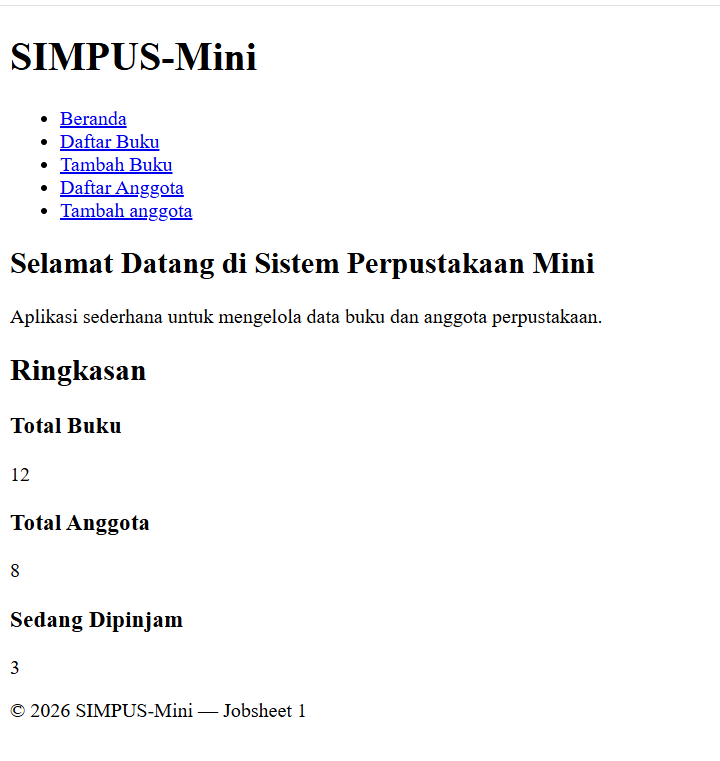
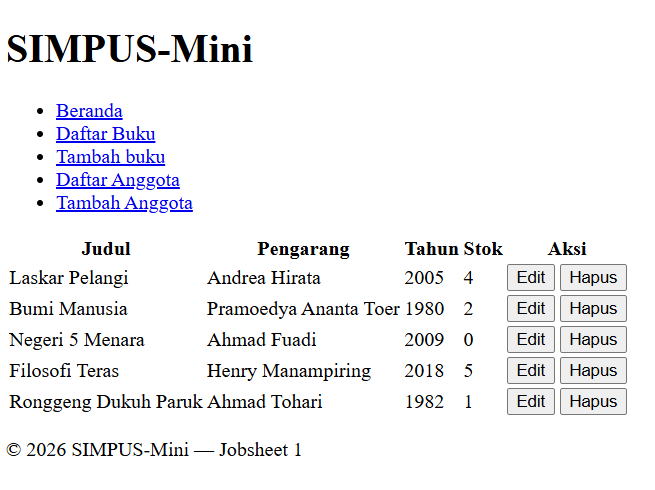
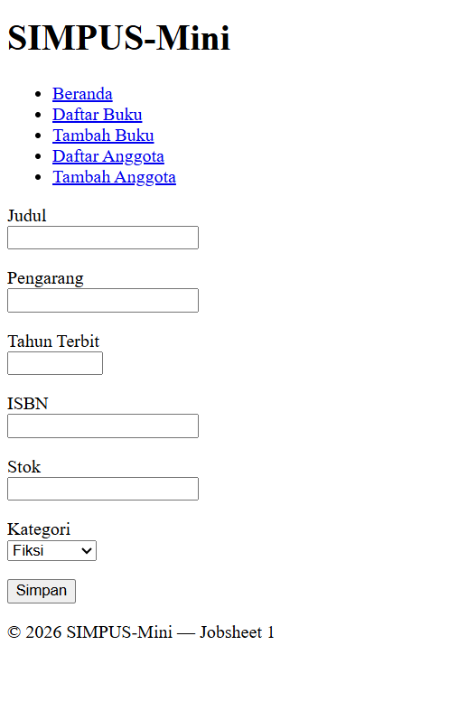
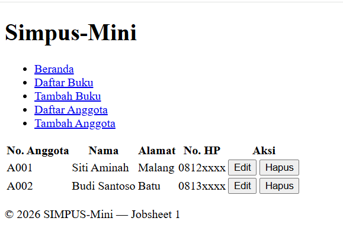
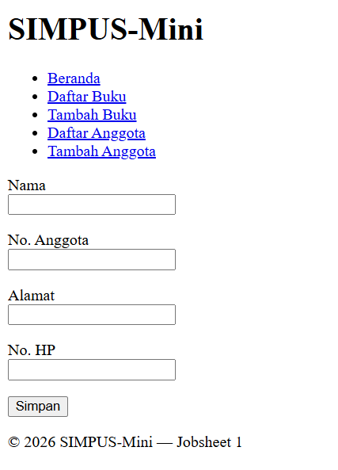

# Laporan Praktikum Desain dan Pemrograman Web Jobsheet 1

<h4>Nama : Faisal Rizky<h4>
<h4>NIM : 254107020224<h4>
<h4>Kelas : TI-2F<h4>

## 1.1 Code Index Html
```
<!DOCTYPE html>
<html lang="id">
<head>
    <meta charset="UTF-8">
    <title>SIMPUS-Mini | Beranda</title>
</head>
<body>
    <header>
        <h1>SIMPUS-Mini</h1>
        <nav>
            <ul>
                <li><a href="index.html">Beranda</a></li>
                <li><a href="buku/list.html">Daftar Buku</a></li>
                <li><a href="buku/tambah.html">Tambah Buku</a></li>
                <li><a href="anggota/list.html">Daftar Anggota</a></li>
            </ul>
        </nav>
    </header>

    <main>
        <section>
            <h2>Selamat Datang di Sistem Perpustakaan Mini</h2>
            <p>Aplikasi sederhana untuk mengelola data buku dan anggota perpustakaan.</p>
        </section>

        <section>
            <h2>Ringkasan</h2>
            <article>
                <h3>Total Buku</h3>
                <p>12</p>
            </article>
            <article>
                <h3>Total Anggota</h3>
                <p>8</p>
            </article>
            <article>
                <h3>Sedang Dipinjam</h3>
                <p>3</p>
            </article>
        </section>
    </main>

    <footer>
        <p>&copy; 2026 SIMPUS-Mini &mdash; Jobsheet 1</p>
    </footer>
</body>
</html>
```
- Membuat halaman pertama yang dibuka ketika aplikasi dijalankan
- berisi mulai dari :
    - header — Kepala Halaman
    - nav — Menu Navigasi
    - main — Konten Utama : berisi section 1 (Sambutan), Section 2(Ringkasan Statistik)
    - Footer — Kaki halaman 

Hasil :


## 1.2 Code buku list
```
 <main>
        <section>
           <table>
            <thead>
                <tr>
                    <th>Judul</th>
                    <th>Pengarang</th>
                    <th>Tahun</th>
                    <th>Stok</th>
                    <th>Aksi</th>
                </tr>
            </thead>
            <tbody>
                <tr>
                    <td>Laskar Pelangi</td>
                    <td>Andrea Hirata</td>
                    <td>2005</td>
                    <td>4</td>
                    <td>
                        <button type="button">Edit</button>
                        <button type="button">Hapus</button>
                    </td>
                </tr>

                <tr>
                    <td>Bumi Manusia</td>
                    <td>Pramoedya Ananta Toer</td>
                    <td>1980</td>
                    <td>2</td>
                    <td>
                        <button type="button">Edit</button>
                        <button type="button">Hapus</button>
                    </td>
                </tr>
                
                <tr>
                    <td>Negeri 5 Menara</td>
                    <td>Ahmad Fuadi</td>
                    <td>2009</td>
                    <td>0</td>
                    <td>
                        <button type="button">Edit</button>
                        <button type="button">Hapus</button>
                    </td>
                </tr>

                <tr>
                    <td>Filosofi Teras</td>
                    <td>Henry Manampiring</td>
                    <td>2018</td>
                    <td>5</td>
                    <td>
                        <button type="button">Edit</button>
                        <button type="button">Hapus</button>
                    </td>
                </tr>

                <tr>
                    <td>Ronggeng Dukuh Paruk</td>
                    <td>Ahmad Tohari</td>
                    <td>1982</td>
                    <td>1</td>
                    <td>
                        <button type="button">Edit</button>
                        <button type="button">Hapus</button>
                    </td>
                </tr>

            </tbody>
           </table>
        </section>
    </main>
```
- Menampilkan tabel list buku

Hasil :


## 1.3 Code buku tambah
```
<main>
            <form>
                <p>
                    <label for="judul">Judul</label><br>
                    <input type="text" id="judul" name="judul" required>
                </p>
                <p>
                    <label for="pengarang">Pengarang</label><br>
                    <input type="text" id="pengarang" name="pengarang" required>
                </p>
                <p>
                    <label for="tahun">Tahun Terbit</label><br>
                    <input type="number" id="tahun" name="tahun" min="1900" max="20260" required>
                </p>
                <p>
                    <label for="isbn">ISBN</label><br>
                    <input type="text" id="isbn" name="isbn">
                </p>
                <p>
                    <label for="stok">Stok</label><br>
                    <input type="number" id="stok" name="stok" min="0" required>
                </p>
                <p>
                    <label for="kategori">Kategori</label><br>
                    <select id="kategori" name="kategori">
                        <option value="fiksi">Fiksi</option>
                        <option value="non-fiksi">Non-Fiksi</option>
                        <option value="referensi">Referensi</option>
                    </select>
                </p>
                <p>
                    <button type="submit">Simpan</button>
                </p>
            </form>
        </main>
```
- Berisi Data buku yang akan ditambahkan dan dikategorikan

Hasil :


## 1.4 Code anggota list
```
 <main>
            <section>
                <table>
                    <thead>
                        <tr>
                            <th>No. Anggota</th>
                            <th>Nama</th>
                            <th>Alamat</th>
                            <th>No. HP</th>
                            <th>Aksi</th>
                        </tr>
                    </thead>
                    <tbody>
                        <tr>
                            <td>A001</td>
                            <td>Siti Aminah</td>
                            <td>Malang</td>
                            <td>0812xxxx</td>
                            <td>
                                <button type="button">Edit</button>
                                <button type="button">Hapus</button>
                            </td>
                        </tr>
                        <tr>
                            <td>A002</td>
                            <td>Budi Santoso</td>
                            <td>Batu</td>
                            <td>0813xxxx</td>
                            <td>
                                <button type="button">Edit</button>
                                <button type="button">Hapus</button>
                            </td>
                        </tr>
                    </tbody>
                </table>
            </section>
        </main>
```
- Isi dan tujuan tidak beda jauh dengan buku list
hanya detail kebutuhannya yang berbeda.
- seperti pada buku ada judul dan pengarang disini no.anggota dan nama

Hasil :
 

## 1.5 Code anggota tambah
```
<main>
            <form>
                <p>
                    <label for="nama">Nama</label><br>
                    <input type="text" id="nama" name="nama" required>
                </p>
                <p>
                    <label for="no_anggota">No. Anggota</label><br>
                    <input type="text" id="no_anggota" name="no_anggota" required>
                </p>
                <p>
                    <label for="alamat">Alamat</label><br>
                    <input type="text" id="alamat" name="alamat">
                </p>
                <p>
                    <label for="no_hp">No. HP</label><br>
                    <input type="text" id="no_hp" name="no_hp">
                </p>
                <p>
                    <button type="submit">Simpan</button>
                </p>
            </form>
        </main>
```

Hasil :

