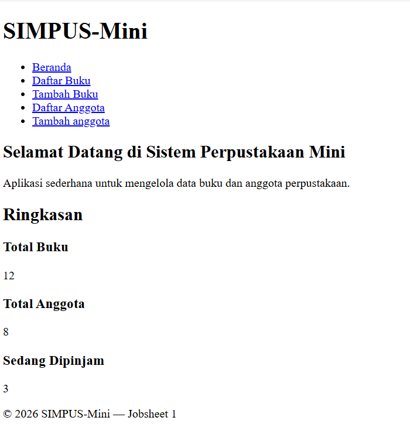
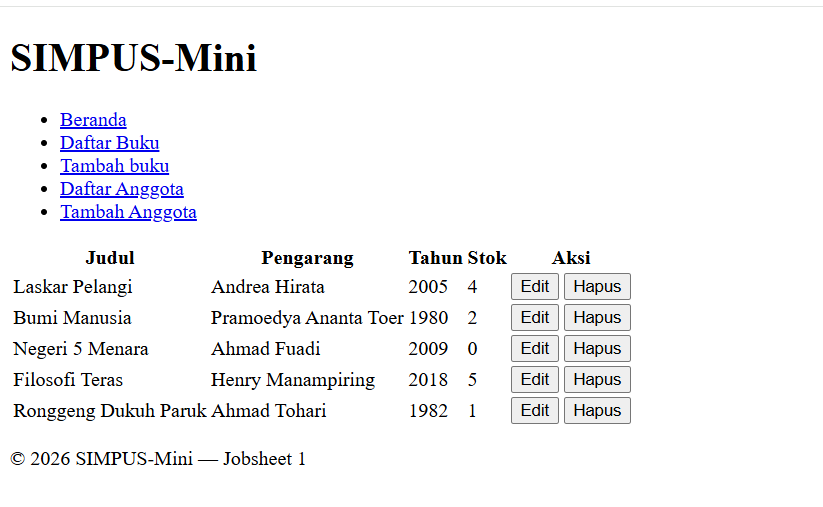
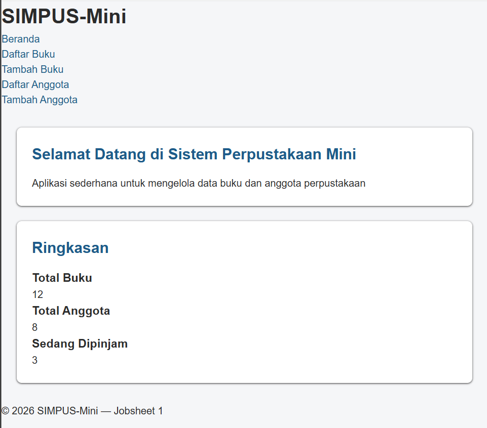

# Laporan Praktikum Desain dan Pemrograman Web Jobsheet 2

<h4>Nama : Faisal Rizky<h4>
<h4>NIM : 254107020224<h4>
<h4>Kelas : TI-2F<h4>

## 2.1 Code Css Reset dan base
```
* {
    box-sizing: border-box;
    margin: 0;
    padding: 0;
}

body {
    font-family: "Segoe UI", Arial, sans-serif;
    color: #2b2b2b;
    background-color: #f5f6f8;
    line-height: 1.5;
}

a {
    color: #1d5b8a;
    text-decoration: none;
}

a:hover {
    text-decoration: underline;
}
```
- Kode ini berfungsi untuk menyamakan tampilan awal di semua browser, sebelum diatur ulang sesuai keinginan.
- Browser selalu membuat link bawaan berwarna biru terang dengan garis bawah

Hasil sebelum :


Hasil Sesudah :


## 2.2 Code Css Hearder dan Navbar
```
header {
    background-color: #1d5b8a;
    color: #fff;
    padding: 1rem 1.5rem;
    display: flex;
    align-items: center;
    justify-content: space-between;
    flex-wrap: wrap;
}

header h1 {
    font-size: 1.4rem;
}

header nav ul {
    list-style: none;
    display: flex;
    gap: 1.25rem;
}

header nav a {
    color: #fff;
    font-weight: 500;
}
```
- Memberikan flexbox, yang semula bertumpuk secara vertikal menjadi horizontal
- Mengubah tatanan warna dan letak header dan navbar

Hasil sebelum :
 
Hasil Sesudah :


## 2.3 Code Css main
```
main {
    max-width: 1000px;
    margin: 2rem auto;
    padding: 0 1.5rem;
}

section {
    background-color: #fff;
    border-radius: 8px;
    padding: 1.5rem;
    margin-bottom: 1.5rem;
    box-shadow: 0 1px 3px rgba(0, 0, 0, 0.08);
}

section h2 {
    margin-bottom: 1rem;
    color: #1d5b8a;
}
```
- agar isi selalu berada di tengah layar dan tidak melebar tak terkendali 
- membuat efek kotak 

Hasil sebelum :

Hasil Sesudah :


## 2.4 Code Css Grid / kartu statistik
```
main section:nth-of-type(2) {
    display: grid;
    grid-template-columns: repeat(3, 1fr);
    gap: 1rem;
}

main section:nth-of-type(2) article {
    background-color: #eef4fa;
    border-radius: 8px;
    padding: 1.25rem;
    text-align: center;
}

main section:nth-of-type(2) article h3 {
    font-size: 0.95rem;
    color: #55677a;
    margin-bottom: 0.5rem;
}

main section:nth-of-type(2) article p {
    font-size: 1.8rem;
    font-weight: 700;
    color: #1d5b8a;
}
```
- Menemukan main dan mencari section dan mengubah gaya didalamnya
- berfungsi membuat blok pengatur layout (grid)
- berfungsi membuat Desain kartu (article)

Hasil Sebelum :

Hasil Sesudah :


## 2.5 Code Css Tabel
```
table {
    width: 100%;
    border-collapse: collapse;
}

th, td {
    text-align: left;
    padding: 0.65rem 0.75rem;
    border-bottom: 1px solid #e2e6ea;
}

thead {
    background-color: #1d5b8a;
    color: #fff;
}

tbody tr:nth-child(even) {
    background-color: #f7f9fb;
}

tbody tr:hover {
    background-color: #eef4fa;
}

td button {
    padding: 0.35rem 0.7rem;
    margin-right: 0.35rem;
    border: none;
    border-radius: 4px;
    cursor: pointer;
    font-size: 0.85rem;
}

td button:first-of-type {
    background-color: #f0ad4e;
    color: #fff;
}

td button:last-of-type {
    background-color: #d9534f;
    color: #fff;
}
```
- code border-collapse, berfungsi merapikan garis ganda
- Membuat garis pemisah antara baris
- Perubahan pada warna tombol

Hasil Sebelum :

Hasil Sesudah :


## 2.6 Code Css Form
```
form p {
    margin-bottom: 1rem;
}

form label {
    display: block;
    margin-bottom: 0.35rem;
    font-weight: 600;
    color: #444;
}

form input,
form select {
    width: 100%;
    max-width: 400px;
    padding: 0.55rem 0.7rem;
    border: 1px solid #cdd4da;
    border-radius: 4px;
    font-size: 1rem;
}

form button[type="submit"] {
    background-color: #1d5b8a;
    color: #fff;
    border: none;
    padding: 0.6rem 1.5rem;
    border-radius: 4px;
    font-size: 1rem;
    cursor: pointer;
}

form button[type="submit"]:hover {
    background-color: #164869;
}
```
- Mengatur Spasi Antar-Kolom Isian (form p)
- Memosisikan Label Teks (form label)

Hasil Sebelum:

Hasil Sesudah:


## 2.7 Code Css Footer
```
footer {
    text-align: center;
    padding: 1.25rem;
    color: #7a8794;
    font-size: 0.9rem;
}
```
- menata teks footer menjadi rata tengah
 
Hasil Sebelum :

Hasil Sesudah :
