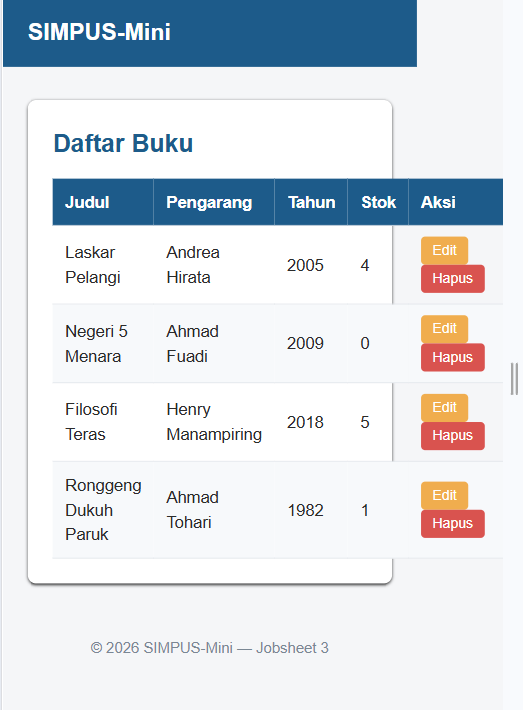
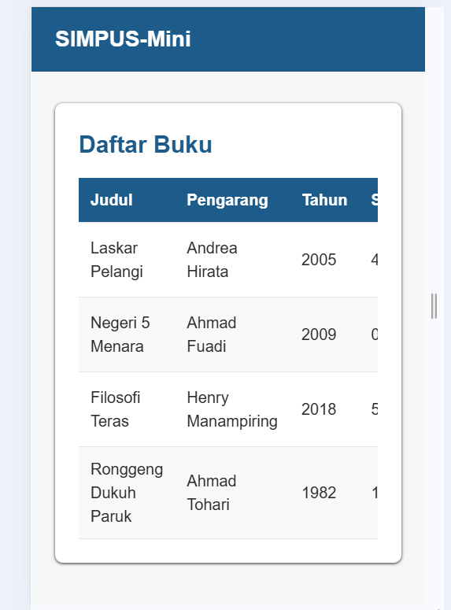
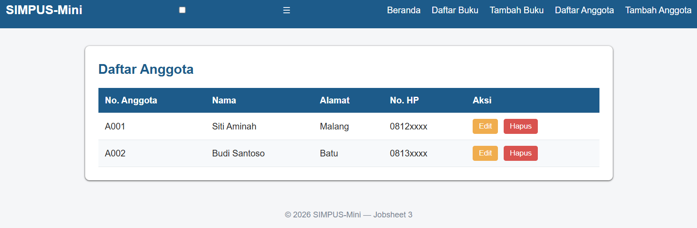
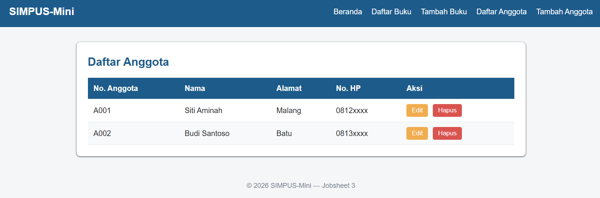
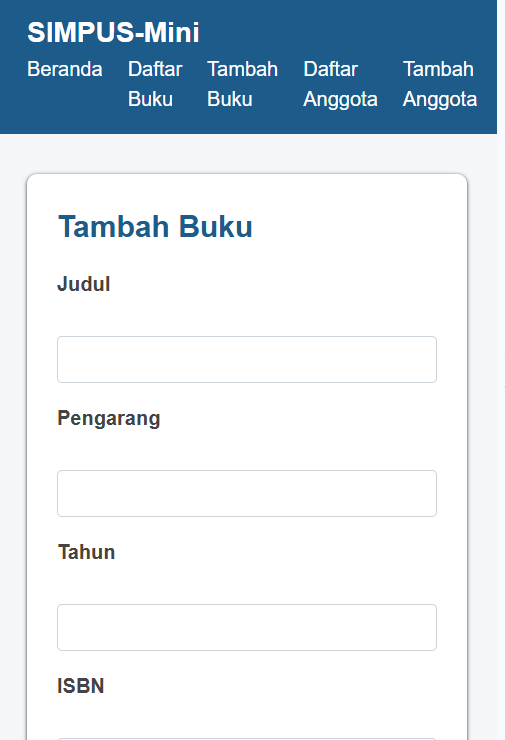
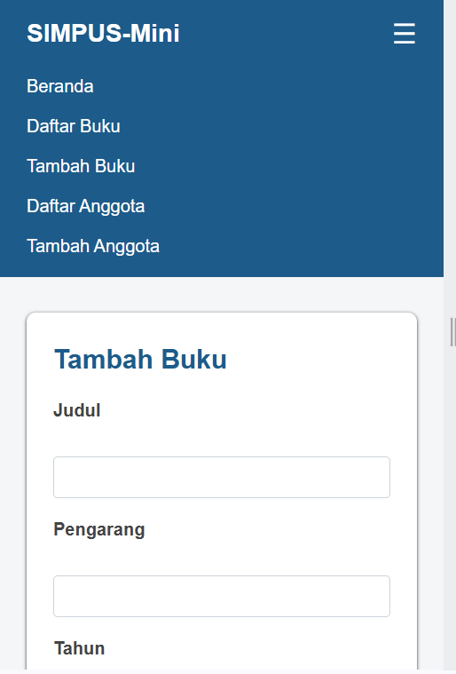

# Laporan Praktikum Desain dan Pemrograman Web Jobsheet 3

<h4>Nama : Faisal Rizky<h4>
<h4>NIM : 254107020224<h4>
<h4>Kelas : TI-2F<h4>

## Tambahan beberapa code pada css
### Tabel responsif :
```
.table-responsive {
    overflow-x: auto;
}
```
pengaruh dari kode ini membuat tabel lebih responsif saat di perangkat mobile, tabel yang terlalu lebar dapat digeser ke kiri dan kanan (horizontal scroll) di dalam areanya sendiri sehingga tampilan halaman tetap rapi.

tanpa code diatas:


dengan code diatas:


### Hamburger menu :
```
.nav-toggle {
    display: none;
}

.nav-toggle-label {
    display: none;
    font-size: 1.6rem;
    color: #fff;
    cursor: pointer;
}
```
code display: none; pada class .nav-toggle dan .nav-toggle-label berfungsi untuk menyembunyikan elemen checkbox icon hamburger menu dari tampilan web

tanpa code :


dengan code :


### Responsive Breakpoint
Tablet kebawah :
```
@media (max-width: 768px) {
    main section:nth-of-type(2) {
        grid-template-columns: repeat(2, 1fr);
    }
}
```
Blok kode ini berfungsi untuk mengatur responsivitas layout pada perangkat mobile seperti tablet


untuk mobile :
```
@media (max-width: 480px) {
    header {
        position: relative;
    }

    .nav-toggle-label {
        display: block;
    }

    header nav {
        display: none;
        width: 100%;
        order: 3;
        margin-top: 1rem;
    }

    .nav-toggle:checked ~ nav {
        display: block;
    }

    header nav ul {
        flex-direction: column;
        gap: 0.75rem;
    }

    main section:nth-of-type(2) {
        grid-template-columns: 1fr;
    }

    form input,
    form select {
        max-width: 100%;
    }
}
```
- code ini berfungsi untuk merapikan menu navigasi yang berisi beranda,dll yang kemudian disembunyikan dan diatur kemunculannya dengan icon hamburger menu dan akan muncul apabila di klik.
- dan digunakan untuk mengoptimalkan tampilan antarmuka pada perangkat smartphone

tanpa code :



dengan code :



## Perubahan code pada semua file Html
```
<meta name="viewport" content="width=device-width, initial-scale=1">
```
berfungsi untuk menyesuaikan dengan tampilan device yang digunakan

```
<input type="checkbox" id="nav-toggle" class="nav-toggle">
<label for="nav-toggle" class="nav-toggle-label">&#9776;</label>
```
-  code input type="checkbox" id="nav-toggle" class="nav-toggle" berfungsi untuk sebagai kotak centang (checkbox) biasa. Tapi lewat CSS , checkbox ini akan disembunyikan dari tampilan
- atribut for="nav-toggle" menghubungkan label ini ke checkbox yang id-nya nav-toggle
